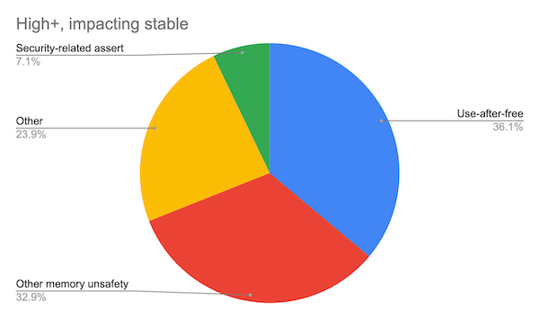

# Problem



> “Around 70% of our high severity security bugs are memory unsafety problems
> (that is, mistakes with C/C++ pointers). Half of those are use-after-free
> bugs.” - [Chromium project](https://www.chromium.org/Home/chromium-security/memory-safety)

```c
typedef struct Dummy { int a; int b; } Dummy;

void foo(void) {
    Dummy *ptr = (Dummy *) malloc(sizeof(struct Dummy));
    Dummy *alias = ptr;
    free(ptr);
    int a = alias.a; // use after free
    free(alias); // double free
}
```
