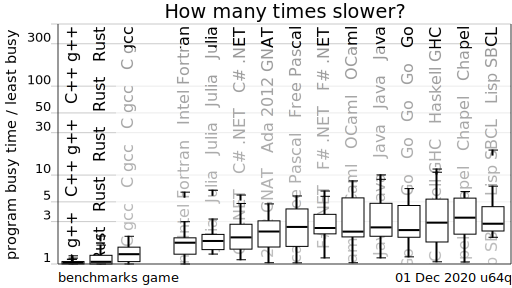
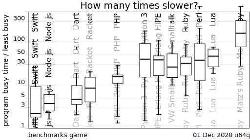
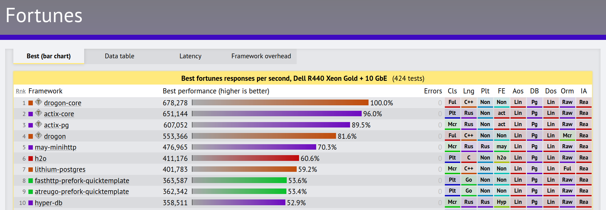

# Performance

## The Computer Language Benchmarks Game

The Computer Language Benchmarks Game is a free software project for comparing
how a given subset of simple algorithms can be implemented in various popular
programming languages. 

## TechEmpower Web Framework Benchmarks

This project provides representative performance measures across a wide field of
web application frameworks across different programming languages and
frameworks. The current tests exercise plaintext responses, JSON serialization,
database reads and writes via the object-relational mapper (ORM), collections,
sorting, server-side templates, and XSS counter-measures.

## Environment friendly software

