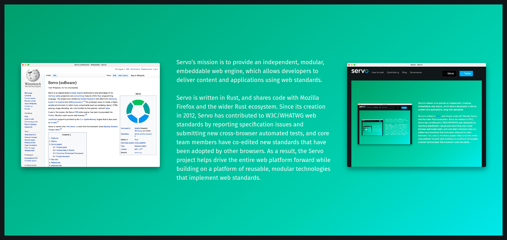

# Mozilla

## Servo

- Experimental browser engine with a focus on performance and concurrency;
- Developed to take advantage of the memory safety properties and concurrency
  features of the Rust programming language.

## Firefox

- Several components developed as part of Servo have been integrated into
  Firefox continuously:
  - [A parallelized CSS Style engine that can speed page load times and improve
    stability](https://hacks.mozilla.org/2017/08/inside-a-super-fast-css-engine-quantum-css-aka-stylo/)
  - [A Paint engine, called WebRender, that moves drawing almost entirely to
    GPUs, ensuring high frame rates and freeing up the CPU to do other
    work](https://hacks.mozilla.org/2017/10/the-whole-web-at-maximum-fps-how-webrender-gets-rid-of-jank/)
  - MP4 metadata parser
